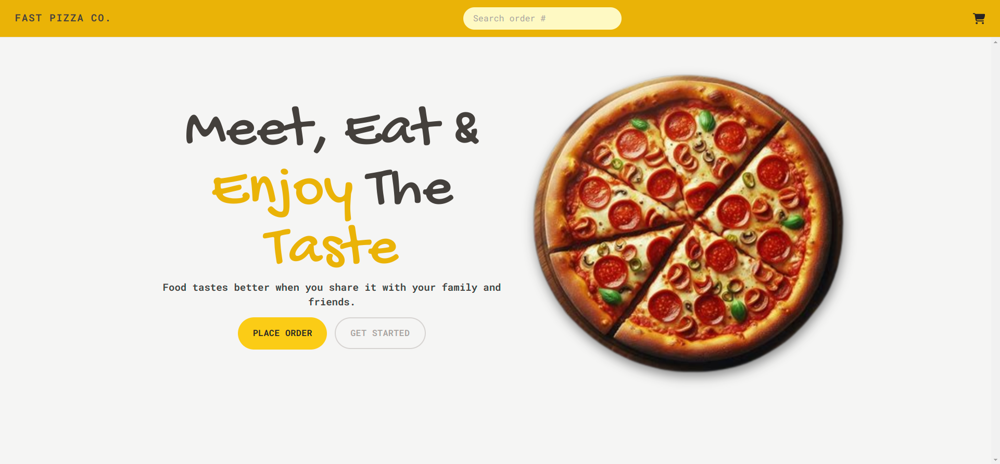

# Fast Pizza App

This is the Fast Pizza app, a project built as part of Jonas Schmedtmann's React course on Udemy. The application is designed to simulate a pizza ordering platform, showcasing various React concepts and best practices.



## Table of Contents

- [Features](#features)
- [Technologies Used](#technologies-used)
- [Getting Started](#getting-started)
- [Author](#author)

## Features

- Browse different pizza options
- Add pizzas to the cart
- Customize pizza orders
- Review and place orders
- Responsive design

## Technologies Used

- **React**: A JavaScript library for building user interfaces.
- **Vite**: A fast build tool for modern web projects.
- **Tailwind CSS**: A utility-first CSS framework for rapid UI development.
- **Redux**: A predictable state container for JavaScript apps.
- **React Router**: Declarative routing for React applications.

## Getting Started

To get a local copy up and running, follow these steps.

### Prerequisites

- Node.js installed on your machine

### Installation

1. Clone the repo:
   ```bash
   git clone https://github.com/ibrahim11elian/fast-pizza-app.git
   ```
2. Navigate to the project directory:
   ```bash
   cd fast-pizza-app
   ```
3. Install NPM packages:
   ```bash
   npm install
   ```
4. Start the development server:
   ```bash
   npm run dev
   ```

## Author

<p align="left">

<a href="https://www.linkedin.com/in/ibrahim-ahmed-a8bba9196" target="_blank">
</a>
<a href="https://www.facebook.com/ibrahim11ahmed" target="_blank">
</a>
<a href="mailto:ibrahim11elian@gmail.com" target="_blank">
</a>
<a href="tel:+201157676284" target="_blank">
</a>
<a href="https://www.instagram.com/ibrahim11ahmed/" target="_blank">
</a>
<a href="https://twitter.com/ibrahim11elian" target="_blank">
</a>
<a href="https://leetcode.com/ibrahim11elian" target="_blank">
</a>

</p>
